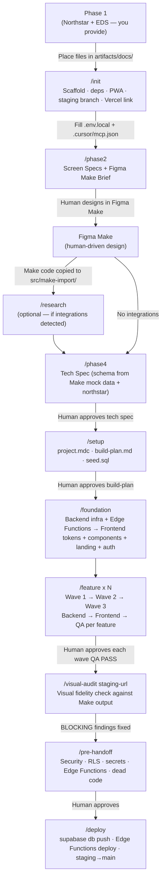

# RAD Template — Rapid App Development Multi-Agent Edition

**Canonical template repo:** [github.com/tad-agentics/RAD-React](https://github.com/tad-agentics/RAD-React) — **source files only.** For **each** product, create a **new** GitHub repository, populate it from this template, and commit **only** in that app repo. **Do not** push app work to `RAD-React`.

**Target:** Idea → deployed product in ~2–3 days.
**Tools:** Cursor with a specialist agent team.

**How this works:** You talk to the Tech Lead (main Cursor session). It orchestrates a lean team of specialist subagents — each with a narrow domain, clear inputs, and defined outputs. Every slash command dispatches the right agent with the right context. You approve gates, agents build.

---

## The Agent Team

| Agent | What it does | Invoked via |
|---|---|---|
| **Tech Lead** | You talk to this. Orchestrates everything, manages gates, owns architecture. | Main Cursor session |
| **Product Designer** | Screen planning, Figma Make prompt guidance, visual QA. | `/phase2`, `/visual-audit` |
| **Backend Developer** | DB schema, migrations, RLS, Edge Functions, webhooks, cron. | `/foundation`, `/feature` |
| **Frontend Developer** | Screens (ported from Figma Make TSX), shared components, mobile viewport. | `/foundation`, `/feature` |
| **QA Agent** | Feature validation end-to-end + pre-handoff safety audit. | `/feature`, `/pre-handoff` |
| **DevOps Agent** | Production deploy — runs once after QA sign-off. | `/deploy` |
| **Research Agent** | External dependency research — SDK docs, auth patterns, webhook specs. | `/research`, auto from `/phase4` and `/new-feature` |

---

## How to Use

Follow these steps exactly, in order. Each step has a clear completion signal before moving on.

---

### Step 1 — One-time machine setup

Do this once per machine. Skip anything already done.

**Accounts:**
- [ ] [Supabase](https://supabase.com) — create **two projects**: one for dev, one for production
- [ ] [Vercel](https://vercel.com) — connect your GitHub account
- [ ] [Figma](https://figma.com) — access to **Figma Make** (human builds the UI prototype here)
- [ ] **Payment provider** — only if product monetizes. Stripe, PayOS, or whichever provider the northstar Payment section specifies. Get **test mode** keys.
- [ ] [Resend](https://resend.com) — only if product sends transactional email. Get an API key.

**Cursor settings:**
- [ ] Settings → Features → Agent → **Auto-run terminal commands → On**
- [ ] Settings → Features → Agent → **Auto-apply edits → On**
- [ ] Model: **Claude Sonnet 4** (or latest) as default

**Global MCP server** — add Context7 to `~/.cursor/mcp.json` (user-level, available in all projects):

```json
{
  "mcpServers": {
    "context7": {
      "command": "npx",
      "args": ["-y", "@upstash/context7-mcp"]
    }
  }
}
```

---

### Step 2 — Create a new repo for this app (never commit the app to `RAD-React`)

**Rule:** One **new** repository per product. The template [`tad-agentics/RAD-React`](https://github.com/tad-agentics/RAD-React) is not your app’s remote — copy or generate from it, then **only** push to **your** app’s repo.

**Option A — GitHub “Use this template” (preferred)**  
On [`RAD-React`](https://github.com/tad-agentics/RAD-React), click **Use this template** → **Create a new repository** (name it for your app) → clone **that** repo:

```bash
git clone https://github.com/[you]/[your-app-repo].git
cd [your-app-repo]
git remote -v   # should show only github.com/[you]/[your-app-repo]
```

**Option B — GitHub CLI** (creates **your** repo from the template in one step):

```bash
gh repo create [app-name] --template tad-agentics/RAD-React --private --clone
cd [app-name]
```

**Option C — You cloned `RAD-React` for a file copy**  
Do **not** leave `origin` as `tad-agentics/RAD-React`. Create an empty repo for the app, then repoint remotes before any push:

```bash
git clone https://github.com/tad-agentics/RAD-React.git [app-name]
cd [app-name]
git remote remove origin
git remote add origin https://github.com/[you]/[app-name].git
git push -u origin main   # or your default branch — only to your app repo
```

**Option D — Populate template files into an empty app checkout**  
Use when you already have a **new** repo (local folder empty except `.git`). Copies the latest from `RAD-React` without using that repo as your `origin`.

In Cursor:

```
/populate-from-rad-react
```

Or run the script (from a checkout that includes `scripts/`, or after downloading it):

```bash
cd /path/to/your-app
./scripts/populate-from-rad-react.sh
```

If you do not have the script file locally yet:

```bash
curl -fsSL https://raw.githubusercontent.com/tad-agentics/RAD-React/main/scripts/populate-from-rad-react.sh | bash -s -- .
```

Then `git remote add origin https://github.com/[you]/[app-name].git` (if needed), commit, and push **only** to your app repo.

---

### Step 3 — Complete Phase 1 (before opening Cursor)

Phase 1 is done **outside** this template — it is a strategic and creative exercise that produces the inputs `/init` needs. Two files are required:

| File | What it is | How to produce it |
|---|---|---|
| `artifacts/docs/northstar-[app].html` | Product northstar — target user, core loop, feature scope, revenue model, retention mechanic, Not Building list | Write with any LLM using a northstar prompt, or manually |
| `artifacts/docs/emotional-design-system.md` **or** `artifacts/docs/eds-[app].html` | Brand voice, visual direction, emotional register, copy tone | Markdown or branded HTML — same content role |

Place the northstar plus **one** EDS file in `artifacts/docs/` before running `/init`. `/init` hard-stops if the northstar or EDS is missing (see `.cursor/commands/init.md` for exact checks).

---

### Step 4 — Open in Cursor and run `/init`

In the main chat session:

```
/init
```

**Authoritative checklist:** `.cursor/commands/init.md` (workspace init, `create-react-router`, deps, Vitest, `.env.local`, base MCP servers, `staging` branch, `vercel link`, `ACTIVE_CONTEXT.md`).

**After `/init` you must fill in:**

| Item | Notes |
|---|---|
| `.env.local` | Supabase URL + publishable key; service role for Edge Functions; Resend/payment vars only if the product uses them |
| `.cursor/mcp.json` | Supabase + Vercel tokens; Context7 needs no token. Never commit. |
| `public/icons/` | PWA icons (192×192 and 512×512, regular + maskable) |
| `public/fonts/` | At least one Vietnamese-compatible `.woff2` for self-hosting |

**Typical env keys** (exact names follow your northstar integrations):

| Variable | Where to get it | Required? |
|---|---|---|
| `VITE_SUPABASE_URL` | Supabase → Project Settings → API → Project URL | Yes |
| `VITE_SUPABASE_PUBLISHABLE_KEY` | Supabase → Project Settings → API → anon / public key | Yes |
| `SUPABASE_SERVICE_ROLE_KEY` | Supabase → Project Settings → API → service_role key | Yes for Edge Functions / local tooling that needs it |
| `RESEND_API_KEY` | Resend → API Keys | Only if app sends email |
| *Payment / other integration vars* | *From northstar Payment + External integrations sections* | *Only if applicable* |

> `.env.local` is gitignored. Never commit it.

Then continue with the **Workflow** below (Phase 2 → … → deploy).

---

## Workflow

**Optional before Phase 4:** If the northstar lists external integrations (payments, email APIs, LLMs, etc.), run `/research` so `artifacts/integrations/` is grounded in current docs. You can also let `/phase4` trigger research when gaps are detected.

**Not a separate step:** `/phase3` is **not** used — visual design and component inventory sit in Figma Make + `/foundation`. See `.cursor/commands/phase3.md`.



---

### Phase 2 — Screen Specs + Figma Make Brief (~35 min)

```
/phase2
```

Product Designer subagent runs. Produces scope plan + screen metadata (routes, components, data variables, states, interaction flows, copy slots) + a structured Figma Make brief.

**After Phase 2:** take the Figma Make brief into Figma Make and design all screens. This is a human-driven step. Iterate until the visual design is approved, then copy all code files from Make's Code tab into `src/make-import/`.

**Gate:** Review `artifacts/docs/screen-specs-[app]-v1.md` + copy Make code into `src/make-import/` → approve to proceed.

---

### Research (if external integrations)

If the northstar includes external integrations (payment providers, LLM APIs, email providers, third-party data sources), run this before Phase 4:

```
/research stripe openai    ← list integrations, or run without args to auto-detect
```

Research Agent fetches current SDK docs via Context7 + web search, produces one structured doc per integration in `artifacts/integrations/`. Phase 4 reads these docs when writing the tech spec — integration contracts are grounded in current documentation, not training knowledge.

`/phase4` will also auto-detect missing integration docs and trigger research inline if needed.

---

### Phase 4 — Tech Spec (~25 min)

```
/phase4
```

Run after Make code is copied to `src/make-import/`. The Tech Lead reads Make's mock data structures alongside the northstar and screen specs to derive the database schema, Edge Function contracts, and data access hooks.

Key: schema MUST produce query results matching Make's mock data shapes. Column names should match mock object property names where possible.

**Gate:** Review `artifacts/docs/tech-spec.md` → approve before running `/setup`.

---

### Setup (~10 min)

```
/setup
Supabase dev project ref: [ref]
Monetizes: [yes/no]
[If yes] Payment provider test keys: [from northstar Payment section]
```

Tech Lead scaffolds `project.mdc`, MCP config, `supabase/seed.sql`, and generates `artifacts/plans/build-plan.md` — the feature dependency graph with per-feature context packages for every build agent.

**Gate:** Review `build-plan.md` → approve to proceed.

---

### Foundation (~1.5h, runs once)

```
/foundation
```

Dispatches two sequential subagents:
1. **Backend Foundation** — Supabase client, `AuthProvider`, `api-types.ts`, hooks (`useAuth`, `useProfile`), schema migrations + RLS, Edge Functions (webhooks, email), **static SEO/PWA files** (robots.txt, sitemap.xml, manifest.json, OG image)
2. **Frontend Foundation** — Move Make's `components/ui/` to `src/components/ui/`, catalog Make's components + build missing state components (EmptyState, ErrorBanner, SkeletonCard), port Make's CSS design tokens (`theme.css` with `@theme inline`) into `src/app.css`, self-host fonts, fix `next-themes` import in sonner.tsx, `useInstallPrompt` hook, **landing page as the first screen**, **auth screens** (login, signup, OAuth callback)

Runs unattended. Both agents commit before signalling done.

---

### Feature Workstreams (~parallel waves)

```
/feature [name]
```

Each feature runs as a sequential pipeline: **Backend → Frontend → QA**.

```
/feature auth
/feature profile-settings   ← run simultaneously with auth (Wave 1)
```

Each pipeline:
1. **Backend subagent** — migration, RLS, data hooks, Edge Functions (if needed) → commits `feat(auth): backend complete`
2. **Frontend subagent** — copies Make screen files into route files, then applies targeted str_replace edits — swaps mock data for real Supabase queries, adds auth/loading/error/empty states → commits `feat(auth): screens complete`
3. **QA subagent** — validates end-to-end against acceptance criteria, writes tests → commits `test(auth): qa pass` or reports BLOCKING issues

The frontend agent's role is **integration**, not construction — Make already built the working UI. The agent keeps Make's layout, styling, and animations, and only replaces data sources.

**Features run in waves** based on the dependency graph in `build-plan.md`. Wave 1 (auth, profile) runs in parallel. Wave 2 (core loop) starts after Wave 1 passes QA. Wave 3 (billing, retention) starts after Wave 2.

**Gate:** Each QA PASS is presented for human approval before the next wave dispatches.

---

### Visual Audit

After all feature waves pass QA, dispatch the Product Designer for a full visual pass on the staging Vercel preview:

```
/visual-audit https://[app]-staging.vercel.app
```

Product Designer checks every screen against the original Make components, AI Slop Guard rules, token compliance, mobile viewport (375px), all four interaction states, copy quality, and dopamine moment fidelity. **Landing page gets a dedicated check:** all 8 sections present, install prompt fires, OG tags validate, copy matches the northstar landing page section. BLOCKING findings must be fixed before pre-handoff.

---

### Pre-Handoff

```
/pre-handoff
```

QA Agent runs the two-pass safety audit — N+1 queries, race conditions, RLS gaps, trust boundaries, Edge Function validation, secrets-in-bundle check, paywall gate integrity, SEO infrastructure completeness, dead code, missing indexes. AUTO-FIX items applied directly; BLOCKING items escalated.

**Gate:** Review findings → resolve all BLOCKING items → approve to deploy.

---

### Deploy

```
/deploy [production-supabase-ref]
```

DevOps Agent:
1. Links to production Supabase project (`supabase link --project-ref`) and runs `supabase db push`
2. Outputs exact Vercel environment variable list — you set these in Vercel Dashboard
3. Prints webhook registration instructions (if applicable)
4. Waits for your confirmation that env vars and webhooks are configured
5. Merges staging → main → pushes → confirms production URL is live

**Smoke check after deploy:**
- [ ] Production loads correctly
- [ ] Signup works with real email
- [ ] Core loop end-to-end
- [ ] Test payment (use payment provider's test mode)
- [ ] Webhook fires correctly (check payment provider dashboard)
- [ ] No errors in Vercel logs + Supabase logs
- [ ] Landing page loads at `/` — all sections visible, install prompt works
- [ ] OG tags validate (Facebook Sharing Debugger + Zalo Debug Tool)
- [ ] PWA installs correctly on Android, iOS shows manual instructions
- [ ] Lighthouse CWV pass — LCP ≤ 2.5s, CLS ≤ 0.1, INP ≤ 200ms

**Commercial readiness (your responsibility — agent outputs the checklist):**
- [ ] Privacy Policy + Terms of Service pages live
- [ ] Cookie consent (if analytics/ad pixels)
- [ ] Payment provider tax/compliance configuration (if applicable)
- [ ] Switch payment provider from test to live keys in Vercel → re-deploy

---

## Session Workflow

Every session starts and ends with a command:

```
/session-start    ← restores context, reports current status + next action
/session-end      ← appends session end block to today's memory file, updates project state
```

If a session drops without `/session-end`, the memory file still contains all work blocks written during the session — context is never fully lost.

---

## Quick Reference

| Phase | Command | Who | Output | Gate |
|---|---|---|---|---|
| Init | `/init` | Tech Lead | Scaffolded workspace | Phase 1 artifacts present |
| Screen Specs | `/phase2` | Product Designer | `screen-specs-[app]-v1.md` + `figma-make-brief.md` | Human approves + completes Figma Make |
| Tech Spec | `/phase4` | Tech Lead | `artifacts/docs/tech-spec.md` | Human approves |
| Setup | `/setup` | Tech Lead | `.cursor/rules/project.mdc` + `artifacts/plans/build-plan.md` (+ `supabase/seed.sql` and integration MCP tweaks per command) | Human approves |
| Foundation | `/foundation` | Backend → Frontend | Shared infra + SEO/PWA files + components + landing page | Auto-proceeds |
| Feature | `/feature [name]` | Backend → Frontend → QA | All feature layers + tests | Human approves each QA PASS |
| Visual audit | `/visual-audit [url]` | Product Designer | Slop audit report | Fix BLOCKING findings |
| Pre-handoff | `/pre-handoff` | QA Agent | Safety audit report | Human approves |
| Deploy | `/deploy [ref]` | DevOps Agent | Production live | — |

**Utility commands:**

| Command | What it does |
|---|---|
| `/session-start` | Restore context, report status + next action |
| `/session-end` | Write session memory, update project state |
| `/status` | Diagnostic — phases, features, build health, open issues |
| `/regen-feature [name]` | Regenerate one feature's context package in `build-plan.md` after a BLOCKING amendment |
| `/research [integration(s)]` | Research external integrations — produces `artifacts/integrations/` docs |
| `/new-feature [description]` | Full post-launch feature cycle: requirements → proposal → feature doc → dispatch → report |
| `/populate-from-rad-react` | Copy RAD-React template files into an empty app folder — run before `/init` on a new repo |
| `/phase3` | **Do not run** — placeholder explaining Make + `/foundation` replaced the old Phase 3 |

---

## What's In This Repo

Layout below is the **target shape** after `/init` and ongoing build work (`src/` and `package.json` appear once init has run).

```
.
│
├── AGENTS.md                           ← Tech Lead reference — team structure, workflow, file map
├── README.md                           ← Minimal project README (populated per project)
├── scripts/
│   └── populate-from-rad-react.sh      ← Clone RAD-React and rsync into target (new app folder)
│
├── .cursor/
│   ├── agents/                         ← Specialist agent definitions
│   │   ├── product-designer.md
│   │   ├── backend-developer.md
│   │   ├── frontend-developer.md
│   │   ├── qa-agent.md
│   │   ├── devops-agent.md
│   │   └── research-agent.md
│   ├── commands/                       ← Slash commands (invoke via /)
│   │   ├── init.md                     ← First-time workspace init
│   │   ├── session-start.md / session-end.md
│   │   ├── phase2.md / phase4.md
│   │   ├── phase3.md                 ← Not dispatched; documents absorbed workflow
│   │   ├── setup.md
│   │   ├── foundation.md
│   │   ├── feature.md
│   │   ├── visual-audit.md             ← Post-build visual fidelity audit
│   │   ├── pre-handoff.md              ← Pre-deploy safety audit
│   │   ├── deploy.md
│   │   ├── research.md                 ← External integration research
│   │   ├── new-feature.md              ← Post-launch feature cycle
│   │   ├── regen-feature.md
│   │   ├── populate-from-rad-react.md  ← Copy template into new app repo
│   │   └── status.md
│   ├── rules/                          ← Cursor rules (auto-loaded by glob or alwaysApply)
│   │   ├── project.mdc                 ← alwaysApply: true — written by /setup
│   │   ├── design-system.mdc           ← component + route files
│   │   ├── frontend.mdc                ← .ts/.tsx files — React Router v7 SPA conventions
│   │   ├── backend.mdc                 ← Supabase + Edge Function files
│   │   └── copy-rules.mdc              ← Copy rules — filled from EDS during /init
│   └── skills/                         ← Explicit-invocation skills
│       ├── wireframes/SKILL.md         ← Phase 2 — screen specs + Figma Make brief
│       ├── design-system/SKILL.md      ← Make component inventory (runs during Foundation)
│       ├── tech-spec/SKILL.md          ← Phase 4 full instructions
│       ├── testing/SKILL.md            ← Per-feature QA checklist
│       └── review/SKILL.md             ← Pre-handoff safety audit
│
├── artifacts/
│   ├── docs/                           ← Planning documents (git-tracked)
│   │   ├── northstar-[app].html        ← Phase 1 input (you provide)
│   │   ├── emotional-design-system.md or eds-[app].html  ← Phase 1 EDS (you provide)
│   │   ├── screen-specs-[app]-v1.md    ← Phase 2 output — screen metadata
│   │   ├── figma-make-brief.md         ← Phase 2 output — Figma Make input
│   │   ├── design-system-spec.md       ← Make component inventory (produced during Foundation)
│   │   ├── tech-spec.md                ← Phase 4 output
│   │   ├── changelog.md                ← Ongoing deviations from spec
│   │   └── features/                   ← Post-launch feature docs (one per /new-feature)
│   ├── integrations/                   ← Integration research docs (one per external dependency)
│   ├── plans/
│   │   ├── build-plan.md               ← Feature dependency graph + per-feature context packages
│   │   └── project-plan.md             ← Phase + feature completion tracker
│   ├── issues/                         ← Issue tracking (kebab-case, one file per issue)
│   └── templates/                      ← ACTIVE_CONTEXT.md, memory, and issue file templates
│
├── agent-workspace/                    ← GITIGNORED — operational memory
│   ├── ACTIVE_CONTEXT.md               ← Current focus + active workstreams
│   ├── memory/                         ← Daily session logs (append-only)
│   └── temp/                           ← Throwaway files (previews, scratch)
│
├── src/                                ← React Router v7 source (written by build agents)
│   ├── routes/                         ← File-based routes (_index, _auth, _app)
│   ├── components/                     ← Shared components
│   ├── hooks/                          ← useAuth, useProfile, useInstallPrompt
│   └── lib/                            ← supabase.ts, auth.tsx, api-types.ts, data/
├── public/                             ← Static files (manifest.json, robots.txt, sitemap.xml, fonts, icons)
├── supabase/                           ← Migrations + seed data + Edge Functions
│   ├── migrations/
│   ├── functions/                      ← Edge Functions (webhooks, cron, email)
│   └── seed.sql
├── .env.example                        ← All env vars documented, values blank
├── package.json                        ← Created/updated by /init (scripts, dependencies)
├── react-router.config.ts              ← SPA mode, prerender: ['/']
├── vite.config.ts                      ← Vite + React Router + Tailwind + PWA
└── vercel.json                         ← SPA rewrite rules
```

---

## Emergency Procedures

**Session drops mid-work:**
Run `/session-start` — it reads `ACTIVE_CONTEXT.md` and today's memory log and picks up from the last written work block.

**Agent drops mid-feature:**
Run `/status` to see exactly where things stand, then re-dispatch the specific agent for the layer that was in progress.

**`npm run build` fails:**
Fix before building the next feature. Never accumulate TypeScript errors — each agent runs `npm run build` before committing, so a failure means the agent will catch it.

**Scope change during build:**
1. Stop the current feature workstream
2. If it requires schema or API contract changes: update `tech-spec.md`, run `/regen-feature [name]` to update the context package, then re-dispatch
3. If it's a new screen or feature: add to `build-plan.md`, assign to a wave, dispatch as a new `/feature`
4. Log as a BLOCKING amendment in `artifacts/docs/changelog.md`

**BLOCKING issue found during QA:**
QA Agent reports BLOCKING issues with specific file paths and descriptions. Tech Lead opens an issue in `artifacts/issues/`, dispatches the relevant agent for a fix, then re-runs QA.
