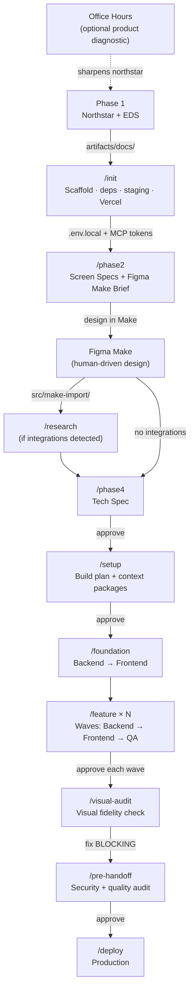

# RAD Guide — From Idea to Production

This is the step-by-step operating manual for the RAD template. Follow it in order. Every step has a clear completion signal before you move on.

---

## Before You Start

### Machine Setup (once per machine)

**Accounts:**
- [ ] [Supabase](https://supabase.com) — create two projects: dev + production
- [ ] [Vercel](https://vercel.com) — connect your GitHub account
- [ ] Payment provider — only if the product monetizes. Stripe, PayOS, or whatever the northstar specifies. Get test mode keys.
- [ ] [Resend](https://resend.com) — only if the product sends email. Get an API key.

**Cursor settings:**
- [ ] Settings → Features → Agent → Auto-run terminal commands → On
- [ ] Settings → Features → Agent → Auto-apply edits → On
- [ ] Model: Claude Sonnet 4 (or latest) as default

**Global MCP server** — add Context7 to `~/.cursor/mcp.json`:

```json
{
  "mcpServers": {
    "context7": {
      "command": "npx",
      "args": ["-y", "@upstash/context7-mcp"]
    }
  }
}
```

### Create the Repo

```bash
gh repo create [app-name] --template your-org/rad-starter --private --clone
cd [app-name]
```

---

## Phase 1 — Product Definition (you do this)

Before opening Cursor, produce two documents using any LLM or manual process:

| File | What it is |
|---|---|
| `artifacts/docs/northstar-[app].html` | Product northstar — target user, core loop, feature scope, revenue model, retention mechanic, moat, auth model, payment, integrations, Not Building list |
| `artifacts/docs/emotional-design-system.md` | Brand voice, visual direction, emotional register, copy tone, forbidden patterns |

Place both in `artifacts/docs/`. The template will hard-stop without them.

### Optional: Product Diagnostic

If you want to stress-test the product idea before committing to a build:

```
/office-hours
```

This runs a 5-question diagnostic modeled on startup office hours — who is the user, what job does the product do, what would a 10-star version look like, what are you explicitly not building, and what unfair advantage do you have. The output is a synthesis that sharpens the northstar before you invest build time.

---

## Phase 2 — Screen Planning

### Configure Environment

Copy `.env.example` to `.env.local` and fill in values:

| Variable | Where to get it | Required? |
|---|---|---|
| `VITE_SUPABASE_URL` | Supabase → Project Settings → API → Project URL | Yes |
| `VITE_SUPABASE_PUBLISHABLE_KEY` | Supabase → Project Settings → API → anon/public key | Yes |
| `SUPABASE_SERVICE_ROLE_KEY` | Supabase → Project Settings → API → service_role key | Yes (Edge Functions only) |
| `RESEND_API_KEY` | Resend → API Keys | Only if app sends email |
| *Payment provider vars* | Per northstar §11 | Only if app monetizes |

> `.env.local` is gitignored. Never commit it.

### Initialize the Project

```
/init
```

The Tech Lead scaffolds the React Router v7 project, installs dependencies, fills in `copy-rules.mdc` from the EDS, creates the staging branch, and links Vercel.

**After `/init`:**
- [ ] Fill in `.env.local` values
- [ ] Fill in `.cursor/mcp.json` tokens (Supabase + Vercel)
- [ ] Place PWA icons in `public/icons/` (192×192 + 512×512)
- [ ] Place a `.woff2` font in `public/fonts/`

### Plan Screens

```
/phase2
```

The Product Designer produces:
1. **Screen specs** — routes, components, data variables, interaction flows, copy slots, loading/error/empty states
2. **Figma Make brief** — structured prompt with brand context, anti-patterns, and per-screen content hierarchy

**Gate:** Review both files → approve.

---

## Phase 3 — Design in Figma Make (you do this)

Take the Figma Make brief and build the complete app prototype. This is the most important human step.

**What Make produces:** A complete working React + Tailwind app — every button works, every form submits, every list renders, all with hardcoded mock data.

**Tips for good output:**
- Paste the Brand Context section into Make's custom rules
- Use realistic mock data (names, dates, prices from the brief)
- Use property names that map to database columns (`displayName`, `creditBalance`)
- Include 3–5 items in lists for visual density
- Let Make handle all visual decisions — colors, typography, spacing, animations

**When done:**
1. Go to Make's Code tab
2. Copy ALL files into `src/make-import/`
3. Tell the Tech Lead to proceed

---

## Phase 4 — Tech Spec

### Research (if external integrations)

If the northstar includes external APIs (payment, LLM, email), run research first:

```
/research stripe openai
```

The Research Agent fetches current SDK docs via Context7 + web search, produces one structured doc per integration in `artifacts/integrations/`. Phase 4 reads these when writing the tech spec — integration contracts are grounded in current documentation, not training data.

### Generate Tech Spec

```
/phase4
```

The Tech Lead reads Make's mock data structures alongside the northstar and screen specs to derive the database schema, Edge Function contracts, and data hooks. Column names match mock object property names where possible.

**Gate:** Review `artifacts/docs/tech-spec.md` → approve.

---

## Setup

```
/setup
Supabase dev project ref: [ref]
Monetizes: [yes/no]
```

The Tech Lead produces `artifacts/plans/build-plan.md` — the feature dependency graph with per-feature context packages. Each package tells the build agents exactly what to build without reading the full spec.

**Gate:** Review `build-plan.md` → approve.

---

## Foundation (~1.5h, unattended)

```
/foundation
```

Two agents run sequentially:

**Backend Foundation:**
- Supabase client, AuthProvider, types, hooks
- Schema migrations + RLS policies + seed data
- Edge Functions (payment webhook, email — if applicable)
- Static SEO/PWA files (robots.txt, sitemap.xml, manifest.json)
- Generate `database.types.ts`

**Frontend Foundation:**
- Move Make's `components/ui/` → `src/components/ui/` (as-is)
- Catalog components + build missing states (EmptyState, ErrorBanner, SkeletonCard)
- Port Make's CSS design tokens into `src/app.css`, self-host fonts
- Build landing page (validates everything works)
- Build auth screens (login, signup, OAuth callback)

**Result:** Landing page live on staging URL. Auth flow working end-to-end.

---

## Feature Waves

```
/feature auth
/feature profile-settings    ← Wave 1 features run in parallel
```

Each feature runs: **Backend → Frontend → QA**.

The frontend agent is an integrator, not a builder:
- Finds the Make component for each screen
- Ports JSX + Tailwind into a route file
- Swaps hardcoded mock data for real Supabase queries
- Replaces fake auth/nav/payment with real implementations
- Adds loading/error/empty states
- Keeps everything else Make generated — layout, styling, animations

### QA Process

The QA agent scopes testing to changed files using `git diff`, runs acceptance criteria validation, and produces a health score:

| Dimension | Weight |
|---|---|
| Visual fidelity (Make spec match) | 15% |
| Data integrity + performance | 20% |
| Security (RLS + auth gates) | 20% |
| Interaction flow completeness | 20% |
| Build + test pass | 15% |
| Copy quality (EDS compliance) | 10% |

If the score drops below baseline, the QA agent reports which dimensions regressed and why. Bug fixes follow atomic commits — one fix per commit, with a regression test committed alongside.

The fix loop includes self-regulation: if fixes are causing more reverts than progress, or the same file has been modified 5+ times, the agent stops and escalates to the Tech Lead.

**Gate:** Approve each QA PASS → next wave starts.

---

## Visual Audit

```
/visual-audit https://[app]-staging.vercel.app
```

Product Designer checks every screen against Make's original components, slop guard rules, mobile viewport, interaction states, copy quality, and landing page completeness.

**Gate:** Fix all BLOCKING findings.

---

## Pre-Handoff

```
/pre-handoff
```

QA Agent runs a comprehensive audit:
- **Security** — OWASP Top 10 checks, RLS gap analysis, secrets-in-bundle scan, Edge Function validation, dependency supply chain review
- **Quality** — N+1 queries, race conditions, dead code, missing indexes, paywall gate integrity

AUTO-FIX items are applied directly. BLOCKING items are escalated with evidence.

**Gate:** Resolve all BLOCKING items → approve.

---

## Deploy

```
/deploy [production-supabase-ref]
```

DevOps Agent:
1. Pushes schema to production Supabase
2. Deploys Edge Functions
3. Lists env vars for Vercel Dashboard
4. Registers webhooks (if applicable)
5. Merges staging → main → confirms production is live

### Post-Deploy Smoke Check

- [ ] Production loads, signup works, core loop completes
- [ ] Payment works (test mode) and webhook fires
- [ ] Landing page renders with OG tags
- [ ] PWA installs on Android, iOS shows instructions
- [ ] Lighthouse: LCP ≤ 2.5s, CLS ≤ 0.1, INP ≤ 200ms

### Commercial Readiness (your responsibility)

- [ ] Privacy Policy + Terms of Service pages
- [ ] Cookie consent (if analytics/ad pixels)
- [ ] Switch payment provider to live keys → re-deploy

---

## Agent Protocols

Every agent in the system follows three shared protocols.

### Structured Questions

When any agent needs a decision, questions follow a 4-part format:
1. **Re-ground** — state the project, current branch, and task (assume the reader hasn't looked in 20 minutes)
2. **Simplify** — explain the problem in plain English with concrete examples
3. **Recommend** — one recommended option with a completeness score (10 = full implementation, 7 = happy path only, 3 = shortcut deferring work)
4. **Options** — lettered choices with effort estimates

### Completion Signals

Every dispatch ends with a status: DONE, DONE_WITH_CONCERNS, BLOCKED, or NEEDS_CONTEXT. Evidence is provided for each claim.

### Escalation

If an agent has attempted a task 3 times without success, is uncertain about a security-sensitive change, or the scope exceeds what it can verify — it stops, reports what was tried, and recommends what to do next. Bad work is worse than no work.

---

## Specialist Skills

Beyond the main workflow, these skills are available for targeted use:

| Skill | Purpose | When to use |
|---|---|---|
| `investigate` | 4-phase root cause analysis (reproduce → analyze → hypothesize → implement) | Complex bugs where the cause spans 3+ files |
| `security-audit` | OWASP + RLS + secrets + deps audit | Automatically during `/pre-handoff`, or manually anytime |
| `testing` | 54 automated rule checks across banned patterns, architecture, and staleness | Runs on agent stop via hooks |

---

## Session Management

Every session starts and ends with a command:

```
/session-start    ← restores context, reports current status + next action
/session-end      ← saves session memory, updates project state
```

If a session drops without `/session-end`, the memory file still contains all work blocks written during the session — context is never fully lost. Memory is updated continuously throughout the session, not just at boundaries.

---

## Emergency Procedures

**Session drops mid-work:**
Run `/session-start`. It reads `ACTIVE_CONTEXT.md` and today's memory log and picks up from the last written block.

**Agent drops mid-feature:**
Run `/status` to see exactly where things stand, then re-dispatch the specific agent for the layer in progress.

**Build fails:**
Fix before building the next feature. Each agent runs `npm run build` before committing, so failures surface immediately.

**Scope change during build:**
1. Stop the current feature workstream
2. If schema/API changes needed: update `tech-spec.md`, run `/regen-feature [name]`, re-dispatch
3. If it's a new feature: add to `build-plan.md`, assign to a wave, dispatch as `/feature`
4. Log as a BLOCKING amendment in `artifacts/docs/changelog.md`

**BLOCKING issue found during QA:**
QA Agent reports with specific file paths and evidence. Tech Lead opens an issue in `artifacts/issues/`, dispatches the relevant agent, then re-runs QA.

---

## Workflow Diagram



---

## Quick Reference

| Command | Who | Output |
|---|---|---|
| `/office-hours` | Tech Lead | Product diagnostic synthesis |
| `/init` | Tech Lead | Scaffolded workspace |
| `/phase2` | Product Designer | Screen specs + Make brief |
| `/phase4` | Tech Lead | Tech spec |
| `/setup` | Tech Lead | Build plan |
| `/foundation` | Backend → Frontend | Infra + components + landing + auth |
| `/feature [name]` | Backend → Frontend → QA | Feature layers + tests + health score |
| `/visual-audit [url]` | Product Designer | Visual fidelity report |
| `/pre-handoff` | QA Agent | Security + quality audit |
| `/deploy [ref]` | DevOps Agent | Production live |

| Utility | What it does |
|---|---|
| `/session-start` | Restore context, report status |
| `/session-end` | Save session memory |
| `/status` | Phase/feature/health diagnostic |
| `/research [name]` | Research external integration |
| `/regen-feature [name]` | Regenerate feature context after amendment |
| `/new-feature [desc]` | Post-launch feature cycle |
